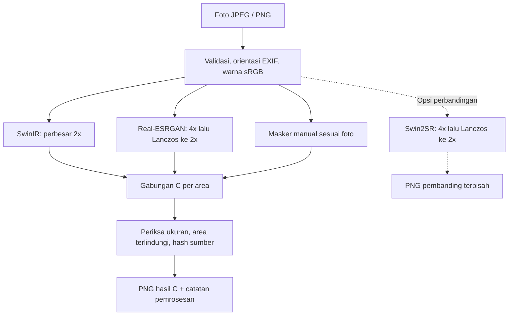

# Pipeline default C

Keputusan pengguna: C menjadi hasil default; Swin2SR hanya opsi perbandingan. C adalah penggabungan dua model, bukan model tunggal. Berlaku pada entry point app.py; skrip batch/eksperimen lama tetap mereproduksi tahap masing-masing.



Model menerima foto sumber yang sama. Secara komputasi, SwinIR selesai dan dilepas dari GPU sebelum Real-ESRGAN dimuat. Swin2SR hanya dimuat jika diminta. Gambar diproses per potongan untuk membatasi memori. Tidak ada degradasi sintetis atau pengecilan input.

C = (1 − alpha) × A + alpha × B. A = SwinIR; B = Real-ESRGAN general-x4v3 dengan denoise 0,5. Bobot alpha berbeda per area. Area inti terlindungi memakai A tepat, dan tepi masker diperhalus. Penggabungan dilakukan dalam RGB sRGB, lalu dibulatkan ke 8-bit. Tidak ada penajaman tambahan.

Masker sampel lama dikenali melalui SHA256 sumber, bukan nama file. Untuk foto baru, buat JSON dengan source_sha256, source_size [lebar, tinggi] sesudah normalisasi orientasi, dan config berisi base_candidate_weight, candidate_regions serta protected_regions. Koordinat mengikuti piksel input; format config sama dengan hybrid_regions.json. Program berhenti sebelum inferensi jika masker foto baru belum tersedia. Deteksi wajah, OCR, segmentasi, serta pemilihan bobot otomatis belum diterapkan.

```powershell
# Default C untuk sampel yang sudah memiliki masker
& .\.venv\Scripts\python.exe app.py --input "foto.jpg"
# Default C dengan masker untuk foto baru
& .\.venv\Scripts\python.exe app.py --input "foto.jpg" --regions "masker-foto.json"
# Tambahkan pembanding; hasil utama tetap C
& .\.venv\Scripts\python.exe app.py --input "foto.jpg" --regions "masker-foto.json" --compare-swin2sr
```

Hasil disimpan dalam folder unik: result_C_x2.png, A_swinir_x2.png, B_realesrgan_x2.png, input_normalized.png, candidate_weight_float32.npy dan processing.json. Opsi perbandingan menambahkan S_swin2sr_comparison_x2.png. Sumber tidak ditimpa. Kegagalan dicatat di failure.json.

Validasi visual sebelumnya memakai dua sampel: C dipilih pengguna; Swin2SR belum memberi manfaat menyeluruh pada konfigurasi uji. Ketajaman bukan jaminan detail asli. Tahap berikut yang belum dikerjakan adalah antarmuka penandaan area, lalu evaluasi pemilihan area otomatis sebelum diterapkan pada foto baru.
